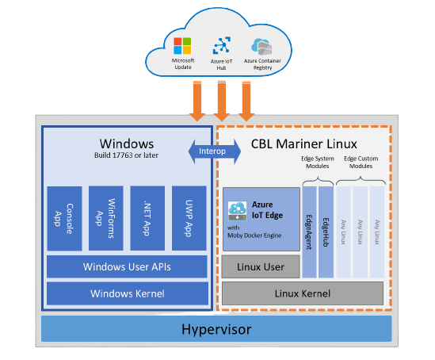

# Azure IoT Edge for Linux on Windows (EFLOW)

[Azure IoT Edge for Linux on Windows](/azure/iot-edge/iot-edge-for-linux-on-windows?view=iotedge-2018-06&preserve-view=true) allows you to run containerized Linux workloads alongside Windows applications in Windows IoT deployments. Businesses that rely on Windows IoT to power their edge devices can now take advantage of the cloud-native analytics solutions being built in Linux.

IoT Edge for Linux on Windows works by running a Linux virtual machine on a Windows device. The Linux virtual machine comes pre-installed with the IoT Edge runtime. Any IoT Edge modules deployed to the device run inside the virtual machine. Meanwhile, Windows applications running on the Windows host device can communicate with the modules running in the Linux virtual machine.

Bi-directional communication between Windows process and the Linux virtual machine means that Windows processes can provide user interfaces or hardware proxies for workloads run in the Linux containers.

[Get started](/azure/iot-edge/how-to-install-iot-edge-on-windows) today.

## Benefits

For organizations interested in running business logic and analytics on devices, Azure IoT Edge for Linux on Windows (EFLOW) enables the deployment of production Linux-based cloud-native workloads onto Windows devices. Connecting your devices to Microsoft Azure lets you quickly bring cloud intelligence to your business. At the same time, running workloads on devices allows you to respond quickly in instances with limited connectivity and reduce bandwidth costs.

By bringing the best of Windows and Linux together, EFLOW enables new capabilities while leveraging existing Windows infrastructure and application investments. By running Linux IoT Edge modules on Windows devices, you can do more on a single device, reducing the overhead and cost of separate devices for different applications.

EFLOW doesn't require extensive Linux knowledge and utilizes familiar Windows tools to manage your EFLOW device and workloads. Windows IoT provides trusted enterprise-grade security with established IT admin infrastructure. Lastly, the entire solution is maintained and kept up to date by Microsoft.

##### Easily Connect to Azure

- **IoT Edge Built-In**. [Tier 1 Azure IoT Edge support](support.md#operating-systems) is built in to EFLOW for a simplified deployment experience for your cloud workloads.

- **Curated Linux VM for Azure**. EFLOW consists of a specially curated Linux VM that runs alongside Windows IoT host OS. This Linux VM is based on [CBL-Mariner Linux](https://github.com/microsoft/CBL-Mariner), and is optimized for hosting IoT Edge workloads.

##### Familiar Windows Management

- **Flexible Scripting**. [PowerShell modules](reference-iot-edge-for-linux-on-windows-functions.md) provide the ability to fully script deployments.

- **WAC**. [Windows Admin Center EFLOW extension](how-to-provision-single-device-linux-on-windows-symmetric.md#developer-tools) (preview, EFLOW 1.1 only) provides a click-through deployment wizard and remote management experience.

##### Production Ready

- **Always Up-to-date**. EFLOW regularly releases feature and security improvements and is reliably updated using Microsoft Update. For more information on EFLOW updates, see [Update IoT Edge for Linux on Windows](./iot-edge-for-linux-on-windows-updates.md).

- **Fully Supported Environment.** In an EFLOW solution, the base operating system, the EFLOW Linux environment, and the container runtime are all maintained by Microsoft—meaning there's a single source for all of the components. Each of the three components: [Windows IoT](/windows/iot/iot-enterprise/commercialization/licensing), EFLOW, and [Azure IoT Edge](version-history.md) have defined servicing mechanisms and support timelines.

##### Windows + Linux

- **Interoperability**. With EFLOW, the whole is greater than the sum of its parts. Combining a Windows application and Linux application on the same device unlocks new experiences and scenarios that otherwise wouldn't have been possible. Interoperability and hardware passthrough capabilities built into EFLOW including, [TPM passthrough](how-to-provision-devices-at-scale-linux-on-windows-tpm.md), [HW acceleration](gpu-acceleration.md), [Camera passthrough](https://github.com/Azure/iotedge-eflow/tree/main/samples/camera-over-rtsp), [Serial passthrough](https://github.com/Azure/iotedge-eflow/tree/main/samples/serial), and more, allow you to take advantage of both Linux and Windows environments.

- **IoT Edge Marketplace.** EFLOW presents an opportunity for Linux developers to target Windows devices, greatly increasing the potential install base. The Azure Marketplace offers a wide range of enterprise applications and solutions that are certified and optimized to run on Azure, including [Azure IoT Edge and EFLOW](https://azuremarketplace.microsoft.com/marketplace/apps/category/internet-of-things?page=1&subcategories=iot-edge-modules).

## Additional Resources

- [EFLOW Documentation](/azure/iot-edge/iot-edge-for-linux-on-windows?view=iotedge-2018-06&preserve-view=true)
- [IoT Show: Run Linux based IoT Edge modules on Windows IoT](https://www.youtube.com/watch?v=UB2yigjg5V8)
- [Get started](/azure/iot-edge/how-to-install-iot-edge-on-windows) today.
