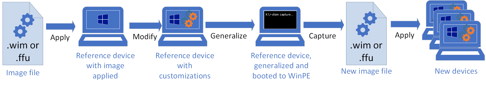

# Audit Mode

Most of our solutions are customized by our OEM partners. OEM software plays a significant role in the functionality of the IoT Device. Windows IoT Enterprise supports OEM customization and allows for a custom-built device to be run on top of the operating system.

To assist our OEM customers, we offer [Audit Mode](/windows-hardware/manufacture/desktop/audit-mode-overview) that allows administrators to boot directly to the desktop before you get to the Windows Welcome screen, giving them the opportunity to install Windows Updates, drivers, and other software as needed.

Audit mode isn't necessarily the only way to implement these customizations. If the following examples don't fit into your workflow, explore the [desktop deployment documentation](/windows/deployment/) for other alternatives.

For a fully automated approach to these steps, consider using the [Windows IoT Enterprise deployment framework](https://github.com/ms-iot/windows-iotent-deploy).

## Overview

When Windows boots, it starts in either Out-Of-Box Experience (OOBE) mode or in audit mode. OOBE is the default out-of-box experience that allows end users to enter their account information, select language, accept the Microsoft Terms of Service, and set up networking.

You can configure Windows to boot to audit mode instead. In audit mode, you can make more changes to the Windows installation before you send the computer to a customer or capture the image for reuse in your organization. For example, you can install drivers included in a driver package, install applications, or make other updates that require the Windows installation to be running. When you use an answer file, Windows processes settings in the auditSystem and auditUser configuration passes.



When you boot to audit mode, you log into the system using the built-in administrator account. After you log on to the system, the built-in administrator account is immediately disabled during the auditUser configuration pass. The next time that the computer reboots, the built-in administrator account remains disabled. For more information, see Enable and Disable the Built-in Administrator Account.

> [!IMPORTANT]
>
> - If you are in audit mode and a password-protected screen saver starts, you can't log back on to the system. The built-in administrator account that was used to log on to audit mode is immediately disabled after logon.
> - To disable the screen saver, either change the power plan through Control Panel or configure and deploy a custom plan. For more information, see Create a Custom Power Plan.
> - Settings in an unattended answer file from the oobeSystem configuration pass don't appear in audit mode.
> - If you're running scripts, installers, and diagnostic tools on Windows S in Audit Mode, you may have to enable manufacturing mode for Windows S. See Manufacturing mode for details.

## Benefits of using Audit Mode

In audit mode, you can:

- Bypass OOBE. You can access the desktop as quickly as possible. You don't have to configure default settings such as a user account, location, and time zone.
- Install applications, add device drivers, and run scripts. You can connect to a network and access more installation files and scripts. You can also install more language packs and device drivers. For more information, see Add a Driver Online in Audit Mode.
- Test the validity of a Windows installation. Before you deploy the system to end users, you can perform tests on the system without creating a user account. Then you can prepare the system to start in OOBE on the next boot.
- Add more customizations to a reference image. This reduces the number of images that you have to manage. For example, you can create a single reference image that contains the basic customizations that you want to apply to all Windows images. You can then boot the reference image to audit mode and make more changes that are specific to the computer. These changes can be customer-requested applications or specific device drivers.

## Add a Feature on Demand (FOD)

Features on Demand (FODs) are Windows feature packages that can be added at any time. Common features include language resources like handwriting recognition or other features like the .NET Framework (.NetFx3).

Device partners often include FODs in Windows images. A commonly added feature is .NET Framework 3.5 to support scenarios where the device is running an OEM application and that needs .NET Framework 3.5 support.

To add a Feature on Demand in audit mode, you need the FOD ISO either on a USB drive, or copied to your IoT device. Once you've finished installing FODs, you can remove the ISO from your IoT device or remove the USB drive.

1. Mount the Feature on Demand (FOD) ISO on the Technician PC.
1. Locate the cab file for the FOD you're going to install. In this example, we use .NET Framework 3.5. The cab is named `Microsoft-Windows-NetFx3-OnDemand-Package~31bf3856ad364e35~amd64~~.cab`. You can view all the FOD .cab names at [Available Features on Demand](/windows-hardware/manufacture/desktop/features-on-demand-non-language-fod).
1. Copy the cab file to the IoT device in a folder called C:\FoD.
1. Add the FOD. From an Administrative Command Prompt:

   ```cmd
   DISM.exe /online /add-package /packagepath:C:\FoD\Microsoft-Windows-NetFx3-OnDemand-Package~31bf3856ad364e35~amd64~~.cab
   ```

1. Verify that the FOD is part of the image:

   ```cmd
   DISM.exe /online /get-capabilities /format:table
   ```

    The output indicates the installation status for all FODs. Verify that the FODs you installed show as **Installed**.

   ```txt
   -------------------------------------------------------- | -----------
   Capability Identity                                      | State
   -------------------------------------------------------- | -----------
   ...                                                      |
   NetFX3~~~~                                               | Installed
   ...                                                      |
   ```

See [Features on Demand](/windows-hardware/manufacture/desktop/features-on-demand-v2--capabilities) to learn more about Features on Demand, including how to add them to an offline mounted image.

## Install drivers

Device partners may need to install more drivers for Windows in order to support the hardware of the IoT device. There are numerous ways to install drivers. The following two options show how to do an installation using the driver vendors supplied setup package and an advanced method to add the driver using DISM.

To add a driver, you need a driver supplied from a hardware vendor. The driver package could be distributed as a .msi, .exe, or .inf file. The process of adding a driver depends on how the driver is distributed.

### Simple method - manual installation

Use this method if the driver supplied by the independent hardware vendor (IHV) is a simple MSI or EXE package. If you want auto driver installation, you can use an unattend file or scripting. The following steps outline an installation.

1. Gather the driver installer package provided by the IHV. This is often an installation MSI or EXE package.
1. Copy the package to a temporary location on the IoT device. In audit mode, the system is logged in locally as the local Administrator account. Run the installation MSI or EXE and follow the prompts.
1. **Optional** Remove the installation package from the temporary location.  

### Advanced method

To use this method, the driver supplied by the IHV has to already be extracted out into INF, SYS, CAT, etc. files, or be an MSI or EXE package that can be extracted. This method can also be used to [add drivers to an offline mounted image](/windows-hardware/manufacture/desktop/add-and-remove-drivers-to-an-offline-windows-image).

1. If the driver is distributed as an MSI or EXE, copy the driver package provided by the IHV into a folder on the IoT device (we use C:\Drivers in our example). If the driver package is a .msi or .exe, extract the contents into a folder.

1. Open an Administrative Command Prompt and use DISM to add all the drivers in the folder.

   ```cmd
   Dism /online /add-driver /driver:C:\Drivers /recurse
   ```

   The `/recurse` option adds all the drivers located in the C:\Drivers folder and its subfolders.

1. Reboot the device if prompted. When the PC reboots, make sure it reboots into audit mode.

## Add a language

Device partners may need to add more languages to an image to enable a user to change languages. This is important for devices that may not have a persistent internet connection to download and install a language with the Settings app.

You can add more languages to your custom image by using DISM to install a language pack and the related Features on Demand. You can add languages in audit mode or to an offline mounted image. For more information, see [Languages overview](/windows-hardware/manufacture/desktop/add-language-packs-to-windows).

1. Mount the Feature on Demand ISO on your Technician PC. This might still be mounted if you added a FOD earlier in the lab.
1. Mount the Language Pack ISO on your Technician PC.
1. Add a language pack to your image. In this example, we use French (fr-FR). From an Administrative Command Prompt:

   ```cmd
   Dism /Add-Package /online /packagepath:"E:\x64\langpacks\Microsoft-Windows-Client-Language-Pack_x64_fr-fr.cab
   ```

    Where E: is the mounted Language Pack ISO

1. Install the language FODs for your language pack.

   ```cmd
   DISM /online /add-package /packagepath:D:Microsoft-Windows-LanguageFeatures-Basic-fr-fr-Package~31bf3856ad364e35~amd64~~.cab /packagepath:D:Microsoft-Windows-LanguageFeatures-OCR-fr-fr-Package~31bf3856ad364e35~amd64~~.cab /packagepath:D:Microsoft-Windows-LanguageFeatures-Handwriting-fr-fr-Package~31bf3856ad364e35~amd64~~.cab /packagepath:D:Microsoft-Windows-LanguageFeatures-TextToSpeech-fr-fr-Package~31bf3856ad364e35~amd64~~.cab /packagepath:D:Microsoft-Windows-LanguageFeatures-Speech-fr-fr-Package~31bf3856ad364e35~amd64~~.cab
   ```

    Where D: is the mounted FOD ISO

## Add a cumulative update

Device partners may need to update the OS image with the latest cumulative update (LCU) as part of the initial image build process. The update can be applied offline using DISM or online using DISM or running the MSU package directly. The following two options show how to do an installation using the MSU or an advanced installation using DISM.

To add an update, you first download the most recent LCU from the [Microsoft Update Catalog](https://www.catalog.update.microsoft.com/Home.aspx), and then install it. You can install the update through the GUI or the command line.

Next, we show you how to install an LCU using a .msu from the Microsoft Update catalog.

### Download an update

These steps can be performed on the Technician PC if the IoT device doesn't have internet connectivity, or if the device scenario requires never connecting to the internet.

1. Visit Windows Update History to see which updates are available for your Windows image.
1. In the upper left of the page, select your Windows build. Select on, for example, Windows, version 1809.
1. In the left-hand navigation, you see a section called In this release. This section shows the most recent LCU's KB number. Select on the latest KB name, which takes you to a KB article with some information about the release.
1. On the KB article page, locate the link for the Microsoft Update Catalog and select the link. This takes you to the download page in the catalog.
1. Download the MSU package from the catalog and save it to C:\Packages on the IoT device.

#### Install an update, simple method

After you've downloaded an update, double select the update in File Explorer to start the installation.

#### Install an update, advanced method

You can install an LCU using DISM. This can be helpful if you're scripting the installation of the update. You can also use this method to add the update to an offline mounted image.  For more information, see [Add updates to a Windows image](/windows-hardware/manufacture/desktop/servicing-the-image-with-windows-updates-sxs).

Use DISM to install the LCU:

From an Administrative Command Prompt:

```cmd
Dism /online /add-package /packagepath:C:\Packages\<package.msu>
```

## Install OEM software

Device partners may need to install software in audit mode. This software might be Line of Business applications, tools, utilities, or any type of software that needs to be on the device prior to shipping. You can use Audit Mode to install software using methods that are available from the Windows desktop, and device partners should use the method that best aligns with their workflow. See

Some things to consider:

- If an installed application is to become the shell experience for the device, follow the steps in [lab 5](iot-ent-shell-launcher-app-launcher.md) to set up Shell Launcher or Assigned Access. The features used depend on the type of application that becomes the shell.
  - Shell Launcher is used if a Win32 or .NET application is used as shell.
  - Assigned Access is used if a UWP application is used as the shell.
- If the device experience is more like a customized desktop experience (for example, a hotel kiosk) where users are able to have access to the desktop, there are customization steps that can make it easier to ensure your device layout is preserved. For example, icon layout on the desktop and start menu can be preserved as part of the Sysprep process.
- This type of installation has to be done in audit mode, and can't be done on an offline mounted image.

## Related Resources

- [Audit Mode Overview](./iot-ent-audit-mode-overview.md)
- [Customize a reference device in Audit Mode](./iot-ent-customize-the-reference-device-in-audit-mode.md)
- [Windows IoT Enterprise Manufacturing Guide](./Manufacturing-Guide.md)
