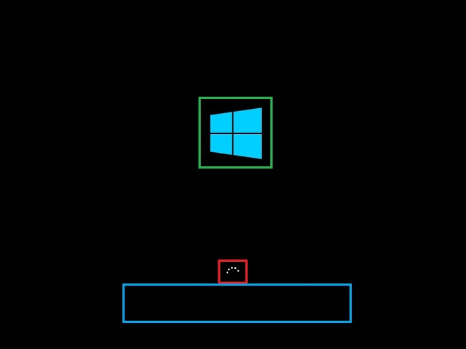

# Unbranded Boot

You can suppress Windows elements that appear when Windows starts or resumes and can suppress the crash screen when Windows encounters an error that it can't recover from. This feature is known as Unbranded Boot.

> [!IMPORTANT]
> The first user to sign in to the device must be an administrator. This ensures that the **RunOnce** registry settings correctly apply the settings. Also, when using auto sign-in, you must not configure auto sign-in on your device at design time. Instead, auto sign-in should be configured manually after first signing in as an administrator.

## Requirements

Unbranded Boot can be enabled on:

- Windows 10 Enterprise
- Windows 10 IoT Enterprise
- Windows 10 Education
- Windows 11 Enterprise
- Windows 11 IoT Enterprise
- Windows 11 Education

## Terminology

- **Turn on, Enable:** To make the setting available to the device and optionally apply the settings to the device. Generally "turn on" is used in the user interface or control panel, whereas "enable" is used for command line.

- **Configure:** To customize the setting or subsettings.

- **Embedded Boot Experience:** this feature is called "Embedded Boot Experience" in Windows 10, build 1511.

- **Custom Boot Experience:** this feature is called "Custom Boot Experience" in Windows 10, build 1607 and later.

## Turn on Unbranded Boot settings

Unbranded Boot is an optional component and isn't enabled by default in Windows. It must be enabled prior to configuring. 

If Windows has already been installed, you can't apply a provisioning package to configure Unbranded Boot; instead you must use BDCEdit to configure Unbranded boot if Windows is installed.

BCDEdit is the primary tool for editing the startup configuration and is on your development computer in the %WINDIR%\\System32 folder. You have administrator rights for it. BCDEdit is included in a typical Windows Preinstallation Environment (Windows PE) 4.0. You can download it from the [BCDEdit Commands for Boot Environment](/previous-versions/windows/hardware/design/dn653986(v=vs.85)) in the Microsoft Download Center if needed.

### Turn on Unbranded Boot by using Control Panel

1. In the Windows search bar, type **Turn Windows features on or off** and either press **Enter** or tap or select **Turn Windows features on or off** to open the **Windows Features** window.
1. In the **Windows Features** window, expand the **Device Lockdown** node, and select (to turn on) or clear (to turn off) the checkbox for **Unbranded Boot**.
1. Select **OK**. The **Windows Features** window indicates that Windows is searching for required files and displays a progress bar. Once found, the window indicates that Windows is applying the changes. When completed, the window indicates the requested changes are completed.
1. Restart your device to apply the changes.

## Configure Unbranded Boot settings at runtime using BCDEdit


1. Open a command prompt as an administrator.
1. Run the following command to disable the F8 key during startup to prevent access to the **Advanced startup options** menu.

   ```cmd
   bcdedit.exe -set {globalsettings} advancedoptions false
   ```

1. Run the following command to disable the F10 key during startup to prevent access to the **Advanced startup options** menu.

   ```cmd
   bcdedit.exe -set {globalsettings} optionsedit false
   ```

1. Run the following command to suppress all Windows UI elements (logo, status indicator, and status message) during startup.

   ```cmd
   bcdedit.exe -set {globalsettings} bootuxdisabled on
   ```

1. Run the following command to suppress error display during boot.

   ```cmd
   bcdedit.exe -set {bootmgr} noerrordisplay on
   ```

## Configure Unbranded Boot using Unattend

You can also configure the Unattend settings in the [Microsoft-Windows-Embedded-BootExp](/windows-hardware/customize/desktop/unattend/microsoft-windows-embedded-bootexp) component to add Unbranded Boot features to your image during the design or imaging phase. You can manually create an Unattend answer file or use Windows System Image Manager (Windows SIM) to add the appropriate settings to your answer file. For more information about the Unbranded Boot settings and XML examples, see the settings in Microsoft-Windows-Embedded-BootExp.

### Unbranded Boot settings

The following table shows Unbranded Boot settings and their values.

| Setting | Description | Value |
|---------|-------------|-------|
| DisableBootMenu | Contains an integer that disables the F8 and F10 keys during startup to prevent access to the Advanced startup options menu. | Set to 1 to disable the menu; otherwise; set to 0 (zero). The default value is 0. |
| DisplayDisabled | Contains an integer that configures the device to display a blank screen when Windows encounters an error that it can't recover from. | Set to 1 to display a blank screen on error; otherwise; set to 0 (zero). The default value is 0. |
| HideAllBootUI | Contains an integer that suppresses all Windows UI elements (logo, status indicator, and status message) during startup. | Set to 1 to suppress all Windows UI elements during startup; otherwise; set to 0 (zero). The default value is 0. |
| HideBootLogo | Contains an integer that suppresses the default Windows logo that displays during the OS loading phase. | Set to 1 to suppress the default Windows logo; otherwise; set to 0 (zero). The default value is 0. |
| HideBootStatusIndicator | Contains an integer that suppresses the status indicator that displays during the OS loading phase. | Set to 1 to suppress the status indicator; otherwise; set to 0 (zero). The default value is 0. |
| HideBootStatusMessage | Contains an integer that suppresses the startup status text that displays during the OS loading phase. | Set to 1 to suppress the startup status text; otherwise; set to 0 (zero). The default value is 0. |

## Customize the boot screen using Windows Configuration Designer and Deployment Image Servicing and Management (DISM)

You must enable Unbranded boot on the installation media with DISM before you can apply settings for Unbranded boot using either Windows Configuration Designer or applying a provisioning package during setup.  

1. Create a provisioning package or create a new Windows image in Windows Configuration Designer by following the instructions in [Create a provisioning package](/windows/configuration/provisioning-packages/provisioning-create-package).

1. In the Available customizations page, select **Runtime settings** &gt; **SMISettings** and then set the value for the boot screen settings. The following values are just examples.

   - **HideAllBootUI**=FALSE
   - **HideBootLogo**=FALSE
   - **HideBootStatusIndicator**=TRUE
   - **HideBootStatusMessage**=TRUE
   - **CrashDumpEnabled**=Full dump

   > [!TIP]
   > For more information, see [SMISettings](/windows/configuration/wcd/wcd-smisettings) in the Windows Configuration Designer reference.

1. Once you have finished configuring the settings and building the package or image, you use DISM to apply the settings.
   1. Open a command prompt with administrator privileges.
   1. Copy install.wim to a temporary folder on hard drive (in the following steps, it assumes it's called c:\\wim).
   1. Create a new directory.

      ```cmd
      md c:\wim
      ```

   1. Mount the image.

      ```cmd
      dism /mount-wim /wimfile:c:\bootmedia\sources\install.wim /index:1 /MountDir:c:\wim
      ```

   1. Enable the feature.

      ```cmd
      dism /image:c:\wim /enable-feature /featureName:Client-EmbeddedBootExp
      ```

   1. Commit the change.

      ```cmd
      dism /unmount-wim /MountDir:c:\wim /Commit
      ```

In the following image, the BootLogo is outlined in green, the BootStatusIndicator is outlined in red, and the BootStatusMessage is outlined in blue.



## Replace the startup logo

The only supported way to replace the startup logo with a custom logo is to modify the Boot Graphics Resource Table (BGRT) on a device that uses UEFI as the firmware interface. If your device uses the BGRT to include a custom logo, it's always displayed and you can't suppress the custom logo.


## Related articles

- [Custom Logon](custom-logon.md)
