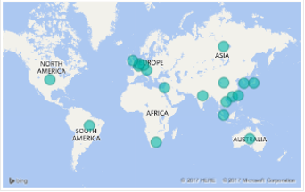

# Windows IoT Distributor Information

Distributors can apply their Windows IoT development experiences, and knowledge, to help you build secure and connected Windows IoT solutions. If you would like to work with one of our distributors, select a distributor in your region and contact the distributor directly for more detail

**Contact Updates:** To update your contact information, submit a request to [IoTDistributorList@microsoft.com](mailto:iotdistributorlist@microsoft.com).

## Americas

 | Location&nbsp;&nbsp;&nbsp;&nbsp;&nbsp;&nbsp;&nbsp;&nbsp;&nbsp;&nbsp;&nbsp;&nbsp;&nbsp;&nbsp;&nbsp;&nbsp;&nbsp;&nbsp;&nbsp;&nbsp;&nbsp;&nbsp;&nbsp;&nbsp;&nbsp;&nbsp;&nbsp;&nbsp;&nbsp;&nbsp; | Distributor&nbsp;Name | Contact&nbsp;Name | &nbsp;&nbsp;&nbsp;&nbsp;&nbsp;&nbsp;&nbsp;&nbsp;&nbsp;&nbsp;Contact&nbsp;Phone&nbsp;&nbsp;&nbsp;&nbsp;&nbsp;&nbsp;&nbsp;&nbsp;&nbsp;&nbsp; |
 | ---------|------------------------|-------------------|:--------------:|
 | Brazil | Softline International BRASIL COMER | [info.brasil@softlinegroup.com](mailto:info.brasil@softlinegroup.com) | +55 11 5188 8100 |
 | United States | Advantech Corporation | [iot.software@advantech.com](mailto:iot.software@advantech.com) | +1 425-922-0721 |
 | United States | Arrow Electronics INC. | Ken Marlin - Windows Champ on YouTube Henry Castillo – Microsoft Champion [WindowsChamp@arrow.com](mailto:WindowsChamp@arrow.com) | +1 (830) 365-7023 |
 | United States | Avnet INC | [Software@Avnet.com](mailto:Software@Avnet.com) | +1 480 643 7055 |
 | United States | Bsquare Corporation | [Info@bsquare.com](mailto:Info@bsquare.com) | + 1 425-519-5900 |
 | United States | Dell, INC. | Jordan Wright [embeddedsoftwaresales@dell.com](mailto:embeddedsoftwaresales@dell.com) | +737 227 1602 |

## APAC

 | Location&nbsp;&nbsp;&nbsp;&nbsp;&nbsp;&nbsp;&nbsp;&nbsp;&nbsp;&nbsp;&nbsp;&nbsp;&nbsp;&nbsp;&nbsp;&nbsp;&nbsp;&nbsp;&nbsp;&nbsp;&nbsp;&nbsp;&nbsp;&nbsp;&nbsp;&nbsp;&nbsp;&nbsp;&nbsp;&nbsp; | Distributor&nbsp;Name | Contact&nbsp;Name | &nbsp;&nbsp;&nbsp;&nbsp;&nbsp;&nbsp;&nbsp;&nbsp;&nbsp;&nbsp;Contact&nbsp;Phone&nbsp;&nbsp;&nbsp;&nbsp;&nbsp;&nbsp;&nbsp;&nbsp;&nbsp;&nbsp; |
 | ---------|------------------------|-------------------|:--------------:|
 | Australia | Advantech Australia PTY Limited | Susie Chen [Susie.Chen@advantech.net.au](mailto:Susie.Chen@advantech.net.au) | +61 3 97970101 |
 | Australia / New Zealand | Avnet Electronics Marketing Australia Pty Ltd | Wayne Leong [Wayne.Leong@AVNET.COM](mailto:Wayne.Leong@AVNET.COM) | +612 9585 5520 |
 | Australia / New Zealand | MDS Pacific PTY Ltd. | Haeli An [haeli@mdspacific.com](mailto:haeli@mdspacific.com) | +61 2-9888-7715 |
 | China | AVNET(Shanghai) Limited | Jack Xu [jackwuhan.xu@avnet.com](mailto:jackwuhan.xu@avnet.com) | +86 18627083759 |
 | China | Beijing Advantech XING YE Electronics | Zicheng Yan [zicheng.yan@advantech.com.cn](mailto:zicheng.yan@advantech.com.cn) CuiCui.Ding [CuiCui.Ding@advantech.com.cn](mailto:CuiCui.Ding@advantech.com.cn) | +86 15818585213  +86 18565739591 |
 | China | Shenzhen Comtech Limited | Selina Gong [selinagong@comtech.com.cn](mailto:selinagong@comtech.com.cn) | +86 15986642886 |
 | China | Dell (China) CO. Ltd. | Gao Defeng [dell.emb.os@dell.com](mailto:dell.emb.os@dell.com) | +86-592-8182210 |
 | China | MDS(Shenzhen) Technology Co.,Ltd | Adam Yi [adamyi@mdspacific.com](mailto:adamyi@mdspacific.com) | +86 18565885612 |
 | China | Lanxiang Technology (Shenzhen) | Becky Wang [beckywang@synnex.com.tw](mailto:beckywang@synnex.com.tw) | +86 13417570375 |
 | China | WT Microelectronics (Shanghai) CO., | Sun Liang [liang.sun@wtmec.com](mailto:liang.sun@wtmec.com) | +86 18600933866 |
 | Hong Kong SAR | Advantech Automation Corp. | Zicheng Yan [zicheng.yan@advantech.com.cn](mailto:zicheng.yan@advantech.com.cn) CuiCui.Ding [CuiCui.Ding@advantech.com.cn](mailto:CuiCui.Ding@advantech.com.cn) | +86 15818585213  +86 18565739591 |
 | Hong Kong SAR | Avnet Technology Hong Kong Limited | Jack Xu [jackwuhan.xu@avnet.com](mailto:jackwuhan.xu@avnet.com) | +86 18627083759 |
 | Hong Kong SAR | Comtech International (Hong Kong) | Selina Gong [selinagong@comtech.com.cn](mailto:selinagong@comtech.com.cn) | +86 15986642886 |
 | Hong Kong SAR | MDS Tech China Holding Co Limited | Adam Yi [adamyi@mdspacific.com](mailto:adamyi@mdspacific.com) | +86-19917267583 |
 | Hong Kong SAR | Syntech Asia Limited | Becky Wang [beckywang@synnex.com.tw](mailto:beckywang@synnex.com.tw) | +86 13417570375 |
 | Hong Kong SAR | WT Microelectronics Ltd. | Sun Liang [liang.sun@wtmec.com](mailto:liang.sun@wtmec.com) | +86 18600933866 |
 | India | Advantech Industrial Computing | Praveen B [Praveen.B@advantech.com](mailto:Praveen.B@advantech.com) | +91 9845071709 |
 | India | MDS Pacific India Pvt Ltd|Sreejith Krishnan [sreejith.krishnan@mdspacific.com](mailto:sreejith.krishnan@mdspacific.com) Prajwal Shetty [prajwal.shetty@mdspacific.com](mailto:prajwal.shetty@mdspacific.com)|+91 78 4784 8412 +91 80 4123 9727 |
| Korea | Advantech KR Co., Ltd.|Zesty Lee [Zesty.Lee@advantech.co.kr](mailto:Zesty.Lee@advantech.co.kr)|+82 2 3660 9220 |
| Korea | MDS Tech Inc.|Sungwoo Park [sungwoo@mdstech.co.kr](mailto:sungwoo@mdstech.co.kr) |+82 31 602 2026 |
| Korea | VOICEYE Co., Ltd.|Young Seung .ko  [ysko@sgacorp.kr](mailto:ysko@sgacorp.kr)|+82 10 3333 4187 |
| Malaysia, Philippines, Singapore, Thailand, Vietnam|Avnet Asia Pte Ltd|Catherine Wong [Catherine.wong@avnet.com](mailto:Catherine.wong@avnet.com)|+65 9681 9211 |
| Singapore,Malaysia, Thailand, Indonesia, Philippine|Advantech Co. Singapore PTE Ltd.|Kenneth Ong [Kenneth.Ong@advantech.com](mailto:Kenneth.Ong@advantech.com)|Mobile: +65-9764 3716 DID: 65-6413 8723 |
| Singapore | Dell Global B.V. (Singapore Branch)|Shree Vidhya [Shree.Vidhya.Aj@dell.com](mailto:Shree.Vidhya.Aj@dell.com)|+91 9739096714 |
| Singapore Malaysia Thailand Indonesia Philippines Vietnam | MDS Pacific PTE Ltd.|Edmund Foo [edmund.foo@mdspacific.com](mailto:edmund.foo@mdspacific.com) Stacey Leaw [Stacey.leaw@mdspacific.com](mailto:Stacey.leaw@mdspacific.com)|+65 6297 2800  |
| Taiwan | Advantech CO., LTD.|Grace Chen  [Grace88.Chen@advantech.com.tw](mailto:Grace88.Chen@advantech.com.tw)|+886 2 27927818 ext. 9292 |
| Taiwan | Chander Electronics Corp.|Fransky Liu [fransky_liu@chander.com.tw](mailto:fransky_liu@chander.com.tw)|+886 2 2218-6500 EXT 861 |
| Taiwan | Synnex Technology Internationals COR|Nicole Wu [peiyinwu@synnex.com.tw](mailto:peiyinwu@synnex.com.tw)|+886 912830162 |

## EMEA

 | Location&nbsp;&nbsp;&nbsp;&nbsp;&nbsp;&nbsp;&nbsp;&nbsp;&nbsp;&nbsp;&nbsp;&nbsp;&nbsp;&nbsp;&nbsp;&nbsp;&nbsp;&nbsp;&nbsp;&nbsp;&nbsp;&nbsp;&nbsp;&nbsp;&nbsp;&nbsp;&nbsp;&nbsp;&nbsp;&nbsp; | Distributor&nbsp;Name | Contact&nbsp;Name | &nbsp;&nbsp;&nbsp;&nbsp;&nbsp;&nbsp;&nbsp;&nbsp;&nbsp;&nbsp;Contact&nbsp;Phone&nbsp;&nbsp;&nbsp;&nbsp;&nbsp;&nbsp;&nbsp;&nbsp;&nbsp;&nbsp; |
 | ---------|------------------------|-------------------|:--------------:|
 | EMEA | Advantech Europe B.V. | Alexander Fritsch [alexander.fritsch@advantech.de](mailto:alexander.fritsch@advantech.de) | +4989411191807 |
 | Netherlands, Belgium & Luxembourg | Advantech Europe B.V. | Franky Gilhuijs [franky.gilhuijs@advantech.nl](mailto:franky.gilhuijs@advantech.nl) | +31402677043 |
 | Germany, Austria & Switzerland           | Advantech Europe B.V. | Horst Mattusch [horst.mattusch@advantech.de](mailto:horst.mattusch@advantech.de) | +4989411191801 |
 | Spain, Portugal | Advantech Europe B.V. | David Ramos [david.ramos@advantech.eu](mailto:david.ramos@advantech.eu) | +34916688676 |
 | Norway, Sweden, Finland & Denmark | Advantech Europe B.V. | Tom Kiviharju [tom.kiviharju@advantech.eu](mailto:tom.kiviharju@advantech.eu) | +46703328995 |
 | UK & Ireland | Advantech Europe B.V. | Darren Chapman [darren.chapman@advantech-uk.com](mailto:darren.chapman@advantech-uk.com) | +442088369742 |
 | France | Advantech Europe B.V. | Carole Bahier [carole.bahier@advantech.fr](mailto:carole.bahier@advantech.fr) | +33141197920 |
 | Italy | Advantech Europe B.V. | Marco Delfavero [marco.delfavero@advantech.it](mailto:marco.delfavero@advantech.it) | +390295449643 |
 | Eastern Europe | Advantech Europe B.V. | David Sum [david.sum@advantech.eu](mailto:david.sum@advantech.eu) | +420731175336 |
 | Rest of EMEA | Advantech Europe B.V. | Sabrina Lin [sabrina.lin@advantech.com](mailto:sabrina.lin@advantech.com) | +886 227927818 Ext. 9269 |
 | South Africa | Arrow Altech Distribution (Pty) Ltd | Riaan van Kooten [RvanKooten@arrow.altech.co.za](mailto:RvanKooten@arrow.altech.co.za) | +27 0 31 279 1660 |
 | EMEA | Arrow Europe | Tze Chiew [WindowsChamp@arrow.com](mailto:WindowsChamp@arrow.com) | +31 (0) 61240 3476 |
 | Netherlands, Belgium, Luxembourg | Arrow Europe | Microsoft Support Team Benelux [sales.ais.benelux@arrow.com](mailto:sales.ais.benelux@arrow.com) | +31 30 899 0730 |
 | Germany, Austria, Switzerland | Arrow Europe | Christian Hammes [chammes@arrow.com](mailto:chammes@arrow.com) | +49 6102 5030 8268 |
 | Italy, Spain, Portugal | Arrow Europe | Davide Chiodi [Davide.Chiodi@arrow.com](mailto:Davide.Chiodi@arrow.com) | +39 02 6612 5388 |
 | Norway, Sweden, Finland, Denmark | Arrow Europe | Microsoft Support NORDIC [sales.ais.nordic@arrow.com](mailto:sales.ais.nordic@arrow.com) | + 46 73 901 76 38 |
 | UK, Ireland | Arrow Europe | Microsoft Support UK&I [sales.ais.northern@arrow.com](mailto:sales.ais.northern@arrow.com) | + 46 73 901 76 38 |
 | France | Arrow Europe | Isabelle Pillois [Isabelle.Pillois@arrow.com](mailto:Isabelle.Pillois@arrow.com) | +33 1 49 97 13 38 |
 | Italy | Arrow Europe | Alberto Alzati [aalzati@arroweurope.com](mailto:aalzati@arroweurope.com) | +39 02 6612 5535 |
 | Israel | Arrow Rapac Ltd. | Danny Morim [dmorim@arroweurope.com](mailto:dmorim@arroweurope.com) | +97 23 920 3479 |
 | Eastern Europe, Iberia | Avnet Silica: Eastern Europe and Iberia | Claudia Remane [microsoft@avnet.eu](mailto:microsoft@avnet.eu) | +49 8121 777 299 |
 | Austria | Avnet Silica : Austria | Thomas Schuller [microsoft@avnet.eu](mailto:microsoft@avnet.eu) | +43 1 86642 308 |
 | Belgium, Netherlands, Luxemburg | Avnet Silica: Belgium, Netherlands, Luxemburg | Patrick Maas [microsoft@avnet.eu](mailto:microsoft@avnet.eu) | +31 76 5722 738 |
 | Switzerland | Avnet Silica, Switzerland | Martin Grossen [mailto:microsoft@avnet.eu](mailto:microsoft@avnet.eu) | +41 62 919 55 57 |
 | Germany | Avnet Silica : Germany | Christine Falke [microsoft@avnet.eu](mailto:microsoft@avnet.eu) | +49 151 1420 6230 |
 | Northern Europe, Denmark, Finland, Sweden & Norway | Avnet Silica: Northern Europe. Denmark, Finland, Sweden & Norway | Mark Winther [Mark.Winther@avnet.eu](mailto:Mark.Winther@avnet.eu) | +45 4322 8027 |
 | Baltic States, Latvia, Lithuania & Estonia | Avnet Silica: Baltic States: Latvia, Lithuania & Estonia | Mark Winther [Mark.Winther@avnet.eu](mailto:Mark.Winther@avnet.eu) | +45 4322 8027 |
 | UK, Ireland, Egypt | Avnet Silica: United Kingdom, Ireland & Egypt | Mark Winther [Mark.Winther@avnet.eu](mailto:Mark.Winther@avnet.eu) | +45 4322 8027 |
 | France | Avnet Silica, France | Benedicte Chagot [Benedicte.Chagot@avnet.eu](mailto:Benedicte.Chagot@avnet.eu) | +33 (1) 64 47 99 96 |
 | Italy | Avnet Silica, Italy | Cesare De Siena [Cesare.DeSiena@avnet.eu](mailto:Cesare.DeSiena@avnet.eu) | +39 (02) 66092 459 |
 | South, West & Central Africa  *Benin, Botswana, Burkina Faso, Cameroon, Central Africa Republic, Chad, Congo, Cote D'Ivoire, Ethiopia, Gabon, Gambia, Ghana, Guinea-Bissau, Kenya, Liberia, Madagascar, Malawi, Mali, Mauritania, Mauritius, Morocco, Mozambique, Namibia, Niger, Nigeria, Senegal, Sierra Leone, Tanzania, Togo, Tunisia, Uganda, Zambia, Zimbabwe* | Avnet Silica | Carl Van der Merwe [Carl.VanderMerwe@avnet.eu](mailto:Carl.VanderMerwe@avnet.eu) | +27 21 68941 47 |
 | Israel | Avnet Silica, Israel | Sharon Grafi [Sharon.Grafi@avnet.eu](mailto:Sharon.Grafi@avnet.eu) | +972 9 7780333 |
 | EMEA | Dell EMEA | Sukhvinder Aulak [Sukhvinder_Aulak@Dell.com](mailto:Sukhvinder_Aulak@Dell.com) | +44 141 202 5493 |
 | Israel | Eastronics Limited | Rivka Helfman [rivka.helfman@easx.co.il](mailto:rivka.helfman@easx.co.il) | +972508885628 +97236458635 |
 | Hungary | Elbacom GmbH | Zsolt Szanya [z.szanya@elbacom.com](mailto:z.szanya@elbacom.com) | +36 (30) 7480458 |
 | Romania | Elbacom GmbH | Zsolt Szanya [z.szanya@elbacom.com](mailto:z.szanya@elbacom.com) | +36 (30) 7480458 |
 | Bulgaria | Elbacom GmbH | Zsolt Szanya [z.szanya@elbacom.com](mailto:z.szanya@elbacom.com) | +36 (30) 7480458 |
 | Estonia, Latvia, Lithuania | Elbacom GmbH | Zsolt Szanya [z.szanya@elbacom.com](mailto:z.szanya@elbacom.com) | +36 (30) 7480458 |
 | Poland | Elbacom GmbH | Tomasz Legat [t.legat@elbacom.com](mailto:t.legat@elbacom.com) | +48 (71) 3399247 |
 | Czech Republic, Slovakia | Elbacom GmbH | Michal Šaštinský [m.sastinsky@elbacom.com](mailto:m.sastinsky@elbacom.com) | +421 (911) 464 089 |
 | Bosnia and Herzegovina, Croatia, Kosovo, North Macedonia, Montenegro, Serbia, Slovenia | Elbacom GmbH | Uros Ribic [u.ribic@elbacom.com](mailto:u.ribic@elbacom.com) | +386 (70) 431288 |
 | Benelux | Elbacom GmbH | Danny Vermeylen [d.vermeylen@elbacom.com](mailto:d.vermeylen@elbacom.com) | +32 (479) 981303 |
 | France | Elbacom GmbH | Pascal Angee    [p.angee@elbacom.com](mailto:p.angee@elbacom.com) | +33 (6) 64404536 |
 | Germany | Elbacom GmbH | Andreas Ahamer [a.ahamer@elbacom.com](mailto:a.ahamer@elbacom.com) | +49 (160) 6712039 |
 | Austria | Elbacom GmbH | David Kotzenmacher [d.Kotzenmacher@elbacom.com](mailto:d.Kotzenmacher@elbacom.com) | +43 (664) 2163502 |
 | Switzerland | Elbacom GmbH | David Kotzenmacher [d.Kotzenmacher@elbacom.com](mailto:d.Kotzenmacher@elbacom.com) | +43 (664) 2163503 |
 | Rest of EMEA | Elbacom GmbH | David Kotzenmacher [d.Kotzenmacher@elbacom.com](mailto:d.Kotzenmacher@elbacom.com) | +43 (664) 2163504 |
 | Belgium | Koning & Hartman B.V. | Kjell De Clercq, Kelly Bornauw, Alida Coninx [Info.be@koningenhartman.com](mailto:Info.be@koningenhartman.com) | +32 2 257 02 00 |
 | Ukraine, Kazakhstan, Uzbekistan, Moldova, Azerbaijan, Georgia, Armenia, Kyrgyzstan, Turkmenistan, Tajikistan | Quarta IoT LLC | Ruben Molunts [sales@quarta-iot.com](mailto:sales@quarta-iot.com) | +374 77 115784 +374 99 115784 |
 | Russia, Ukraine, Belarus, Kazakhstan, Uzbekistan, Moldova, Azerbaijan, Georgia, Armenia, Kyrgyzstan, Turkmenistan, Tajikistan | Quarta Technologies | [mse@quarta.ru](mailto:mse@quarta.ru) | +7 495 123 4518 |

## Japan

 | Location&nbsp;&nbsp;&nbsp;&nbsp;&nbsp;&nbsp;&nbsp;&nbsp;&nbsp;&nbsp;&nbsp;&nbsp;&nbsp;&nbsp;&nbsp;&nbsp;&nbsp;&nbsp;&nbsp;&nbsp;&nbsp;&nbsp;&nbsp;&nbsp;&nbsp;&nbsp;&nbsp;&nbsp;&nbsp;&nbsp; | Distributor&nbsp;Name | Contact&nbsp;Name | &nbsp;&nbsp;&nbsp;&nbsp;&nbsp;&nbsp;&nbsp;&nbsp;&nbsp;&nbsp;Contact&nbsp;Phone&nbsp;&nbsp;&nbsp;&nbsp;&nbsp;&nbsp;&nbsp;&nbsp;&nbsp;&nbsp; |
 | ---------|------------------------|-------------------|:--------------:|
 | Japan | Avnet K.K. | Toshitaka Saito [Toshitaka.Saito@AVNET.COM](mailto:Toshitaka.Saito@AVNET.COM) MS Support [akk-ms-support@avnet.com](mailto:akk-ms-support@avnet.com) | +81 3 5792 9820 |
 | Japan | Okaya Electronics Corp. | Hideaki Nagai [nagai@oec.okaya.co.jp](mailto:nagai@oec.okaya.co.jp) Software Promotion Group [info_ms@oec.okaya.co.jp](mailto:info_ms@oec.okaya.co.jp) | +81 45 475 1502 |
 | Japan | Ryoyo Electro Corporation | Toshihiko Kanazawa [Toshihiko_kanazawa@ryoyo.co.jp](mailto:Toshihiko_kanazawa@ryoyo.co.jp) IS MSIS Division [msoem@ryoyo.co.jp](mailto:msoem@ryoyo.co.jp) | +81 3 3546 6211 |
 | Japan | Tokyo Electron Device Limited | Toshinori Suzuno [suzuno.t@teldevice.co.jp](mailto:suzuno.t@teldevice.co.jp) IoT&nbsp;Company&nbsp;Embedded&nbsp;Division [esg@teldevice.co.jp](mailto:esg@teldevice.co.jp) | +81 45 443 4422 |
